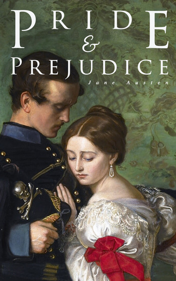

  

# Interactions of Characters in Pride and Prejudice Novel

*Project for the course "Projekt Zespołowy (II Stopień)" at UKSW.*

## Team 5

Team Members:
- Michał Żelazko, Manager
- Norbert Zabost, Documentation
- Polina Konetskaia, Github repo
- Damian Kantorowski
- Rafał Wielądek

## Current State of The Project

### What is done
- Downloaded and cleaned the book for processing ([process_book.py](./process_book.py) and [data](./data))
- Researched related work to identify state-of-the-art (SOTA) methods  
- Tested two Named Entity Recognition (NER) models on the book ([character_extraction.py](./character_extraction.py) and [results](./results))  
- Performed initial tests for interaction detection ([interactions.py](./interactions.py))
### Tasks
- Finish character extraction

<!-- NER (Named Entity Recognition) tools as BookNLP, Stanford NER, Illinois NER or IXA-NERC. -->
## Research

English and Polish Public domain books are available at https://www.gutenberg.org/ and https://wolnelektury.pl/.

We have lecture presentations from the Natural Language Processing course, kindly shared with us by dr. Katsiaryna Kosarava.
### Related work
- A comprehensive overview of the methods used for creating character networks - [Extraction and Analysis of Fictional Character Networks](papers/Extraction%20and%20Analysis%20of%20Fictional%20Character%20Networks.pdf)
- Character network analysis based on "A Song of Ice and Fire" novels and "Game of Thrones" series - https://networkofthrones.com/

## Notes

- Prepare a few short text samples that highlight specific challenges the method may encounter and test how well it handles them. For example:

  > A and B were discussing in the kitchen. C enters the room and says something to them.

  > A and B were discussing in the kitchen, while D and E were in the garden. C enters the kitchen and says something.
